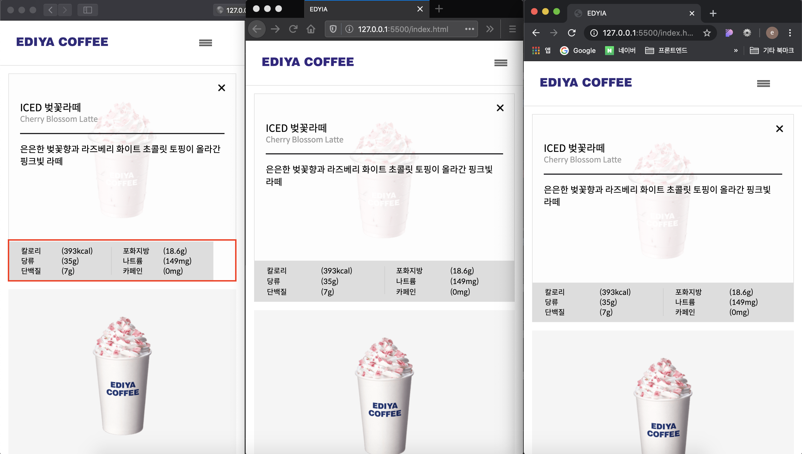

# safari table tag width 100% error

프로젝트를 진행하다 크로스브라우징 확인 중에 다른 브라우저와 달리 safari에서 `table` 의  `width:100%` 값이 부모요소의 `padding` 값을 뺀 영역만 차지했다. 



순서대로: 사파리, 파이어폭스, 크롬

원인을 열심히 분석해보았지만 결론적으로는 safari에서 `table`이 다른 브라우저와 구현되는게 다르다는 것이었다. 뭐, 안되면 이 방법 저 방법 찾아서 해결 하면 됐지만 원인이 너무 찝찝하였다. 뭐.. 구현이 그렇게 된다는데 가서 따질 수 없으니 여러가지 해결방안을 찾아보았다. 


1. **자바스크립트로 제어**

   조원들끼리 머리 맡대고 짰던 방안으로 조원 중 한명이 타닥하고 코드를 짰다. 자바스크립트로 브라우저가 사파리일 경우에만 width값을 넣어주는 방식.

   ```javascript
   var is_safari = /^((?!chrome|android).)*safari/i.test(navigator.userAgent);
   if (is_safari) {
       $('.detail__table--ingre').css({
           'width': 'calc(100% + 40px)'
       });
   }
   ```

   그렇지만 강사님께서 이 방법은 비추하셨다. 차라리 CSS에서 오류를 해결하기보단 회피하는것이 더 나은 방안이라고 말씀해주셨다. 

   

2. **`table` , `th` , `td` 의 `display: block` ,`inline-block` 으로 변경**

   `display`를`block`으로 변경시키는 방법으로 부모의 크기값을 잘 가져온다. 하지만 테이블 배치가 다 바뀌기 때문에 하위요소들 또한  `display`를 변경시켜야 한다. 결국 태그만 의미적으로 `table`이지만 배치는 다시해야하는 아이러니한 상황이..

   

3. **CSS hack으로 제어**

   ```css
   @media not all and (min-resolution:.001dpcm) { 
       @supports (-webkit-appearance:none) and (display:flow-root) { 
           .detail__table--ingre { 
               width:calc(100% + 40px); 
           } 
       } 
   }
   ```

   와.. 해보면서 소리질렀던 방법. CSS hack이란 일부 브라우저의 버그를 위해 그 브라우저에만 CSS를 적용하는 방법이다. 지금 사용한 CSS는 사파리 브라우저일 경우에만 CSS가 적용되는 방법이다.

   [참조링크](https://browserstrangeness.bitbucket.io/css_hacks.html#safari)


> 🧚‍♀️
>
> 프로젝트를 진행하면서 해결은 자바스크립트로 했지만 베스트 방법은 더 좋은 방안이 찾았으니 앞으로 우회하거나 hack을 사용해야겠다.

