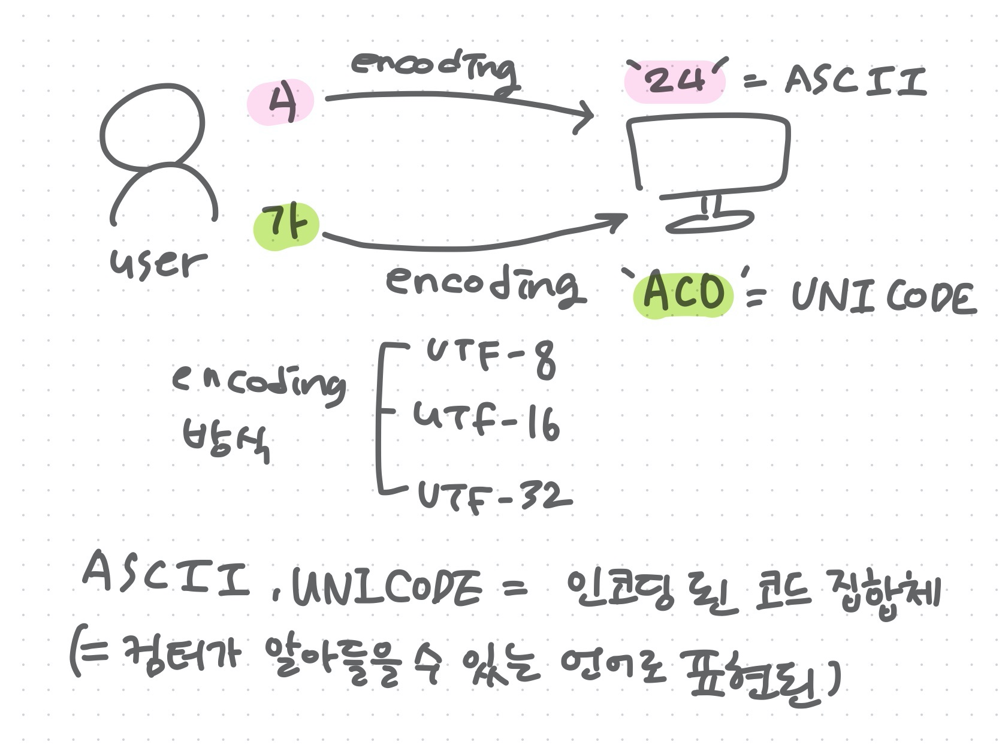

# JavaScript lesson 4 - 5


## 변수

###  1. 변수란 무엇인가? 왜 필요한가?

- 컴퓨터에 값을 저장하기위해 확보한 메모리 공간 자체
- 메모리 공간의 위치를 식별하기 위해 붙인 이름

> 메모리?
>
> 메모리는 데이터(값)를 저장할 수 있는 메모리 셀로 이뤄져있다. 메모리 셀의 크기는 1byte(8bit)이며 이 단위로 데이터를 저장하거나 읽어 들인다. 이때 컴퓨터는 0, 1로 데이터를 처리하기 때문에 우리가 알고있는 텍스트, 숫자, 특수문자 상관없이 2진수(0 또는 1)로 알려주어야 하며 이 데이터들은 메모리 셀에 저장된다.

메모리에 값을 주어 연산을 한 뒤 결과 값이 나왔을때, 한번의 값을 확인할 수 있지만 또다시 그 값을 재사용 할 수 없다는 문제가 있다. 

메모리의 고유 주소로 값에 직접 접근이 가능하지만 시스템을 멈추게 할 수 있는 치명적인 오류가 발생할 수 있어 자바스크립트 개발자는 직접적인 메모리 제어에 제한적이다. 

그렇기때문에 기억하고 싶은 값에 위치를 식별할 수 있도록 변수를 지정하는 것이다.

```javascript
var result = 10 + 20;
```

10과 20은 메모리에 저장되며 CPU를 통해 연산된다. 그 값으로 30은 result(식별자)에 할당된다. 이 할당된 값을 변수 값이라고 한다.

```javascript
result
// 30
```

변수를 재사용하기 위해 변수를 입력하면 변수에 저장된 값을 읽어들인다.

- 변수에 값을 저장하는 것 = 할당(assignment)

- 변수에 저장된 값을 읽어 들이는 것 = 참조(reference)


### 2. 식별자

- 메모리의 주소에 붙인 이름

식별자(=변수명)는 사람이 이해하기 쉽도록 지정해야 의미를 명확하게 전달할 수 있다. 메모리에 저장되어 있는 값들을 구별하여 식별할 수 있도록 해야하며 식별자는 값이 저장되어 있는 **메모리의 주소**를 기억해야 한다. 그렇기 때문에 식별자는 값이 아닌 메모리의 주소를 기억한다. 즉 메모리 값에 바로 접근할 수 없다는 것을 의미하며 식별자는 메모리의 주소에 붙인 이름이라고 할 수 있다.


### 3. 변수 선언

변수 선언이란 변수를 생성하는 것을 의미한다.

```javascript
var score;
// score라는 변수를 생성한다.
```

변수의 키워드

- var 키워드는 뒤에 오는 변수 이름으로 새로운 변수를 선언할 것을 지시하는 키워드

상수

- let
- const

> 키워드
>
> 자바스크립트 코드를 해석하고 실행하는 자바스크립트 엔진이 수행할 동작을 규정한 일종의 명령어

변수 선언 이후 특정 값이 할당되지 않았지만 선언에 의해 확보된 메모리 공간의 값은 자바스크립트의 엔진에 의해 **undefined라는 값이 암묵적으로 할당**되어 **초기화**된다.

```javascript
var a = 123; // 변수를 선언하여 초기화 시켜 undefined의 값을 나타냄
a; // 123
a = 345; // 값을 할당했기 때문에 123이 아닌 345가 나옴

var a = 78; // undefined
// 변수를 재선언 했기때문에 초기화 한게 아니라
// 표현식이 아닌 문 (선언문)이기때문에 undefined

```


#### 자바스크립트 변순 선언 수행 전 단계

- 선언 단계 : 변수 이름을 등록하여 자바스크립트 엔진에 존재를 알린다.
- 초기화 단계 : 값을 저장하기 위한 메모리 공간을 확보하고 암묵적으로 `undefined`를 할당한다.

```javascript
var score; // 선언 단계, 초기화 단계를 거쳐 수행한다.
score = 100; // 변수에 값을 할당한다.
```

> 변수 이름은 어디에 등록될까?
>
> 메모리 공간에서 등록되는 것이 아닌 변수 이름을 비롯한 모든 식별자는 실행 컨텍스트에 등록된다. 자바스크립트 엔진은 실행 컨텍스트를 통해 식별자와 스코프를 관리한다. 
>
> ```javascript
> var score = 100;
> ```
>
> 변수의 이름과 변수 값은 실행 컨텍스트 내에 key, value 형식인 객체로 {key : score, value : 100} 등록되어 관리된다.

초기화를 거치지 않는다면 확보된 메모리 공간에 이전에 어플리케이션이 사용했던 값이 남아 있을 수 있다. 이 값을 쓰레기 값이라고 한다.

```javascript
var score; // undefined

score = 100; // 쓰레기 값

score = 80; // 재할당
```

???? 이해안가는 문장 - 예시가 필요함

만약 초기화 단계를 거치지 않으면 확보된 메모리 공간에는 이전에 다른 애플리케이션이 사용했던 값이 남아 있을 수 있다. 이러한 값을 쓰레기 값(garbage value)이라 한다. 따라서 **메모리 공간을 확보한 다음 값을 할당하지 않은 상태에서 곧바로 변수 값을 참조하면 쓰레기 값**이 나올 수 있다.


### 4. 변수 선언의 실행 시점과 변수 호이스팅

변수 선언은 **런타임 되기 전 준비단계에서 실행**된다. 하지만 런타임 이전 변수 선언단계에서 실행되어진 값들이기 때문에 암묵적으로 `undefined`값이 할당된다. 이후 런타임에서 값이 할당된다. 

```javascript
console.log(score); // undifined = undefinde라는 값이 호이스팅에 의해 할당 됨

var score; // 런타임 전 변수 선언 실행
score = 100; // 런타임에 실행

console.log(score); // 100
```

이처럼 런타임 실행 전 값이 할당되어 위로 끌어올려진 것 처럼 보이는 것을 호이스팅이라고 한다.


### 5. 값의 할당

변수에 값을 할당하며(저장한다) 이때 할당 연산자(=)를 사용한다.

> 자바스크립트에서 `=`은 같다라는 개념과 조금 다르게 값을 저장한다라는 개념이 강하다.

```javascript
var score; // 변수의 식별자 선언 = 식별자로 메모리 공간 확보
score = 100; // 변수 값 할당 
```

또는

```javascript
var score = 100; // 변수 선언과 값의 할당을 동시에 할 수 있다.
```

자바스크립트 엔진은 런타임 이전 변수 선언과 런타임에 값의 할당으로 구분하여 실행한다.  

```javascript
console.log(score); // 2. undifined  

var score; // 1. 할당 값 : undifined
score = 100; // 3. 재할당 값 : 100

console.log(score); // 4. 100
```

위 예제와 같이 자바스크립트 엔진에 의해 변수 선언이 된 시점에서 메모리 공간이 확보되어 `undefined` 값이 할당되어지고 런타임에서 코드가 순차적으로 진행됨에 따라 첫 `console`의 `score`의 값은 `undefined`이며 `score`값을 `100`으로 재할당함으로써 기존 메모리 공간을 재사용하는 것이 아닌 새로운 메모리의 공간을 확보하여 값을 저장했기때문에 마지막 `console`의 `score`값은 `100`이다.


**[ 예제 ]**

마지막 `console.log`에는 어떤 값이 나올까?

```javascript
console.log(score); // undefined

score = 80; // 값의 할당
var score; // 변수 선언

console.log(score); // 80 런타임 이전 메모리의 공간을 score로 선언되어진 값이 undefined였지만 런타임에 값을 재할당하여 80이 출력된다.
```


## ASCII Code

정보교환용 7비트 부호체계

- 미국정보교환표준부호 = ASCLL(American Standard Code for Information Interchange)

- 미국 국가 표준 협회가 개발

- 영문 알파벳을 사용하는 대표적인 문자 인코딩(컴퓨터에 표현하는 방식)

- 7비트 인코딩으로 총 128개의 문자들로 이뤄진다.

- 1byte가 8bit인 이유의 결정적인 원인

  과거 : 아스키코드 (7비트) + 패리티 비트(1비트) = 검출되지 않는 에러도 많아 현재엔 사용되지 않음

  => 현재 : 0 + 아스키코드 (7비트)

- 아스키 기반 확장 인코딩 등장

  아스키 코드는 영숫자(제어 문자와 확장 아스키 코드 포함)만 표현할 수 있는 인코딩으로 다른나라 언어에 적합하지 않았고, 전 세계의 모든 문자를 다루도록 설계된 표준 문자 전산 처리방식인 유니코드가 등장하였다.
  
- 아스키코드와 유니코드

  아스키코드와 유니코드는 컴퓨터가 사용할 수 있는 언어로 변환하는 방식이다. 이때 유니코드의 인코딩 방식은 여러가지로 나눠지며 현재 UTF-8인코딩을 사용한다.

  

  


---

**출처**

- [위키백과](https://ko.wikipedia.org/wiki/ASCII) 
- [나무위키]([https://namu.wiki/w/%EC%95%84%EC%8A%A4%ED%82%A4%20%EC%BD%94%EB%93%9C](https://namu.wiki/w/아스키 코드))
- [poiem블로그](https://poiemaweb.com/)

