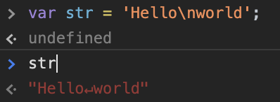
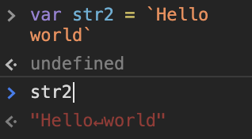

# JavaScript lesson 6 - 7

## 데이터 타입

자바스크립트는 7가지의 데이터 타입을 제공하며 원시 타입과 객체 타입으로 분류 할 수 있다.

- 원시 타입(primitive) 

  변수를 할당될 때 메모리 상에 고정된 크기로 저장되고 해당 변수가 원시 데이터 값을 보관한다.

  - 숫자(number) 타입
  - 문자(string) 타입
  - 불리언(boolean) 타입
  - undefined 타입
  - null 타입
  - Symbol 타입

- 객체 타입 또는 참조 타입(object / reference type) 

  크기가 정해져 있지 않고 변수에 할당될 때 값이 직접 해당 변수에 저장될 수 없으며 변수에는 데이터에 대한 참조만 저장(데이터의 주소만 저장)된다. 

  - 객체, 함수, 배열

### 1. 숫자 타입

다른 언어인 C나 Java의 경우 정수, 실수를 구분하지만 자바스크립트는 구분하지 않고 하나의 숫자 데이터 타입만을 갖는다.

ESCMAScript 사양에 따르면 숫자타입의 값은 **배정밀도 64비트 부동소수점 형식**을 따른다. 즉 모든 수는 정수든 음의 정수든 실수든 실수로 표현하는 데이터 타입이다.

```javascript
var interger = 10;  // 정수
var doble = 10.12;  // 실수
var negative = -20; // 음의 정수

// 실수를 제외한 정수, 2진수, 8진수, 16진수 등 모두 수를 표한하는 값은 그 값들 만의 데이터 타입을 제공하지 않아 값을 참조하면 10진수로 해석한다.
```

추가적으로 3가지 특별한 값들도 표현할 수 있다.

```javascript
// 숫자 타입의 3가지 특별한 값
console.log(10 / 0);       // Infinity
console.log(10 / -0);      // -Infinity
console.log(1 * 'String'); // NaN
```

###### 🙄 궁금사항

---

**Q.** 숫자 타입의 특별한 값인 양의 무한대, 음의 무한대, 산술 연산 불가들을 표현할 수 있다고 했는데 그럼 숫자 타입이 갖는 값은 실수, 양의 무한대, 음의 무한대 산술 연산 불가인가????

**A.** 

---


### 2. 문자열 타입

문자열 타입은 텍스트 데이터를 나타내는데 사용한다. 문자열은 0개 이상의 16bit 유니코드 문자들의 집합으로 전세계 대부분 언어를 표현 할 수 있다.

1과 "1"이 다르듯 string과 "string" 은 다르다. 문자열 타입은 ', ", `으로 텍스트를 감싸 표기한다. 일반적인 표기법은 작은 따옴표를 사용하는 것이다.

#### 문자열 타입 표기법

- 작은 따옴표 `''` : 자바스크립트에서 일반적인 표기법
- 큰 따옴표 `""`
- 백틱 ` : ES6에서 추가된 표기법

#### 만약 표기법을 지키지 않는다면?

```javascript
// 1. 따옴표를 붙이지 않았을 경우 
var string = hello // ReferenceError: hello is not defined
// hello도 식별자로 인식하기 때문에 참조 에러가 뜬다.

// 2. 따옴표를 붙이지 않고 공백 문자를 포함할 경우
var string = hello world //Uncaught SyntaxError: Unexpected identifier
// 식별자를 정확히 인식하지 못해 문법 에러가 뜬다. ???? 맞나
```


### 3. 템플릿 리터럴

문자열 표기법이지만 ES6부터 새롭게 추가된 문자열 표기법이다. 템플릿 리터럴은 런타임에 일반 문자열로 변환되어 처리되며 일반 문자열 데이터와 달리 백틱을 사용하여 값을 할당한다.

???? 처리된다. 무엇을 위해 처리하는거지

#### 템플릿 리터럴 특징????

- 멀티라인 문자열 (mulit-line string)
- 표현식 삽입 (expresstion interpolaton)
- 태그 템플릿 (tagged template)

#### 3.1 멀티라인 문자열

일반 문자열 내에서 줄바꿈은 허용되지 않는다.

```javascript
var str = 'Hello
world';
// SyntaxError: Invalid or unexpected token
// 잘못된 토큰이라는 문법 에러
```

만약 일반 문자열에서 개행을 하려면 백슬래시 `\`  로 시작하는 이스케이트 시퀀스를 사용해야한다.



템플릿 리터럴 내에서는 이스케이프 시퀀스 사용 없이도 줄바꿈이 허용된다.




#### 3.2 표현식 삽입

문자열들을 연결하려면 덧셈 연산자인 `+`를 사용할 수 있다. 이때 덧셈 연산자는 덧셈의 기능이 아닌 문자열 연산자로 동작한다.

```javascript
var first = 'ga hyun';
var last = 'Kim';

console.log('My name is ' + fist + last + ' !');
// My name is ga hyumKim !
```

템플릿 리터럴에서는 백틱과 중괄호를 이용하여 가독성을 높이고 간편하게 문자열을 조합 할 수 있다.

```javascript
var first = 'ga hyun';
var last = 'Kim';

console.log(`My name is ${first} ${last} !`)
// My name is ga hyum Kim !
// 띄어쓰기에 대한 고민이 줄어든다..
```


### 4. 불리언 타입

불리언(boolean) 타입의 값은 논리적 참, 거짓을 나타내는 true와 false 뿐이다.

```javascript
var foo = true;
console.log(foo); // true

foo = false;
console.log(foo); // false
```


### 5. undefined 타입

undefined 타입의 값은 undefined뿐이다.

var키워드로 선언한 변수는 undefined로 초기화 되는데 기존에 공간에 할당되어 있던 쓰레기 값을 undefined로 덮어씌어진다.

```javascript
var foo; // foo 변수 선언

console.log()
```

