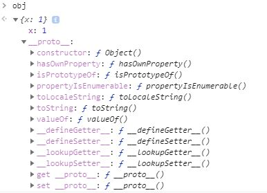
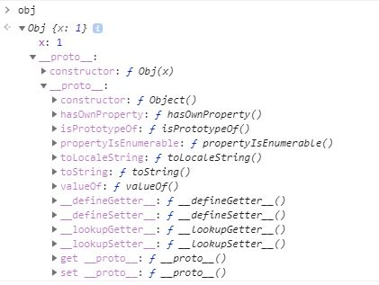
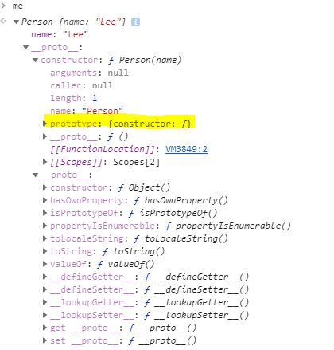

# JavaScript lesson 18 - 19


```js
function Person(name) {
  this.name = name;
  this.sayHi = function (){
    console.log(`name is ${this.name}`);
  };
}

const me = new Person('Lee');
const you = new Person('Kim');
console.log(me.sayHi === you.sayHi); // false

// 문제점 1. sayHi일반함수다.
// 문제점 2. 생성자함수가 호출될때마다 함수가 만들어진다. 메모리 위치도 다르다. 참조값을 비교하기 때문에 false이다. 
// name은 객체의 상태를 나타내는 데이터 값인데 인수마다 다르다.
// 메소드의 역할은 객체 상태를 나타내는 것을 조작하거나 참조하는 것
// 대부분의 메소드는 같지만 프로퍼티는 다르다. 


```

```js
// 문제점을 해결하기 위해 바꾼 코드
function Person(name) {
  this.name = name;
  this.sayHi = foo;
}
// 함수를 외부에 생성한다.
function foo (){
  console.log(`name is ${this.name}`);
};


const me = new Person('Lee');
const you = new Person('Kim');

// 왜 미완성이라고 하지? 외부에서 함수를 변경할 수 없기 때문이다.
// 절차 지향형은 이렇게 함
```

```js
// 객체 지향 관점에서 "상속을 하자!"
// 이 코드에서 주체에 상속이 가능할까?

function Person(name) {
  this.name = name;
  this.sayHi = function (){
    console.log(`name is ${this.name}`);
  };
}

const me = new Person('Lee'); // 주체
const you = new Person('Kim'); // 주체
// 어떤 식별자를 찾을때 프로토타입 체인에 의해 찾음
// 상속도 재사용 = 프로토타입도 재사용을 위해 쓰는 것.
// 프로토타입 = 상속 매커니즘.
```


call back 함수는 인수를 함수로 받는다.

함수형 프로그래밍을 하려면 함수가 값이여야 한다.


## 함수와 일급 객체

### 1. 일급 객체

완전히 값과 똑같은 것을 일급 객체라고 한다.

**[ 일급 객체의 특징 ]**

1. 무명의 리터럴로 생성

   만약에 기명이면 이름이 있기 때문에 리터럴 자체로도 의미가 있다. 근데 리터럴에 이름이 없다면 반드시 어딘가에 할당을 해줘야 한다. 만약 무명 리터럴을 이름을 할당 안한다면 재사용을 할 수 없다.

   즉, 변수에 할당하라는 얘기. 함수를 사용하기 직전에 생긴다. 

   무명리터럴을 만들수 있다는 얘기는 함수를 호출하면서 함수를 만든다.

2. 변수나 자료 구조(객체, 배열)에 저장

   객체에 넣는 것 그게 바로 메소드

3. 함수의 매개 변수에게 전달

   

4. 함수의 결과값으로 반환

   함수의 리턴값이 된다.

자바스크립트 함수는 위 특징을 모두 만족하므로 일급 객체이다.

함수는 값으로 평가된다 = 일급 객체다.

함수는 객체다. 함수 === 객체 ? nop. 객체 내부에 함수가 포함된다. 함수 고유의 속성이 객체의 속성보다 더 많다.

객체는 호출할 수 없으나 함수는 호출할 수 있다. 


`Object.~` 메소드를 제공하는 빌트인 객체, 생성자 함수

### 2. 함수 객체의 프로퍼티

함수는 객체임으로 함수도 프로퍼티를 가질 수 있다. 

함수 객체는 일반 객체에 없는 arguments, caller, length, name, prototype, \__proto__ 프로퍼티가 존재한다.

```js
function square(number) {
  return number * number;
}
// 호출 전이기때문에 어떤 함수인지 모른다. 
console.log(Object.getOwnPropertyDescriptors(square));
/*
square이 직접 가지고 있는 프로퍼티들
{
  length: {value: 1, writable: false, enumerable: false, configurable: true},
  name: {value: "square", writable: false, enumerable: false, configurable: true},
  arguments: {value: null, writable: false, enumerable: false, configurable: false},
  caller: {value: null, writable: false, enumerable: false, configurable: false},
  prototype: {value: {...}, writable: true, enumerable: false, configurable: false}
}
__proto__는 보이지 않는데 이것은 부모에게 상속되었기 때문이다.
*/
```

하지만 여기서 `__proto__`는 볼 수 없는데 이것은 함수 객체의 프로퍼티가 아닌 Object.prototype 객체의 접근자 프로퍼티이다. 즉 `__proto__`는 Object.prototype 객체로부터 상속받았다.

> `console.dir(객체명)` 해당 객체의 프로퍼티를 볼 수 있음


#### 2.1 arguments 프로퍼티

프로퍼티는 맞으나 ES3에서 폐지되었다. 근데 왜 크롬에서는 출력되었지? 모든 자바스크립트 엔진이 표준을 따르지 않는다.. 그래서 크롬에서 출력됨. arguments 프로퍼티가 존재하는데 걔의 값이 arguments 객체.

```js
const f = function () {
  // console.log(f.arguments); // 예전방식
  // console.log(arguments); // 그냥 다이렉트로 볼 수 있다!!!!!
  let res = 0;
  for (let i = 0; i < arguments.length; i++ ){
    res += argments[i];
  }
}
console.log(f(1, 2, 3));
// Arguments(3) [1, 2, 3, callee: ƒ, Symbol(Symbol.iterator): ƒ]

// 파라미터를 몇 개 올지 결정못하는 경우가 있는데 근데 다 더해줘, 그럼 매개변수를 몇 개로 해야하나?? 그렇게면 매개변수의 개수를 정할 수 없다. 그래서 매개변수 정의를 안하는데 인수를 어떻게 받아야할까? 이때!! arguments를 이용하여 인수의 개수를 구해 몇 번 더할지 정한다. 

// 문제점 : 매개변수를 정의할 수 없었다. 
// 해결방법 : function ( ...args ) {}
```


함수 객체의 arguments 프로퍼티 값은 arguments 객체이다. arguments 객체는 함수 호출 시 전달된 인수(argument)들의 정보를 담고 있는 순회 가능한(iterable) 유사 배열 객체(array-like object)이며 함수 내부에서 지역 변수처럼 사용된다. 

**유사배열객체로 for문을 돌릴 수 있다.**


함수 객체는 arguments라는 프로퍼티를 갖는데 arguments의 프로퍼티 값은 arguments 프로퍼티 객체이다. arguments는 함수에 전달된 인수를 보관한다. 이때 인수는 arguments 객체의 프로퍼티 값으로 소유되고 프로퍼티 키는 인수의 순서를 나타낸다.

> aruments 객체의 Symbol(Symbol.iterator) 프로퍼티
>
> arguments 객체의 Symbol(Symbol.iterator) 프로퍼티는 arguments 객체를 순회 가능한 자료 구조인 이터러블(iterable)로 만들기 위한 프로퍼티다.

arguments 객체는 유사 배열 객체이다. 객체가 length 프로퍼티를 갖고 있다면 유사 배열 객체이다.


#### 2.2 caller 프로퍼티

비표준 프로퍼티다. 자신을 호출한 함수를 가리킨다.


#### 2.3 length 프로퍼티

함수 객체의 length 프로퍼티는 함수 정의 시 선언한 **매개변수의 개수**를 가리킨다.

```js
function foo() {}
console.log(foo.length); // 0

function bar(x) {
  return x;
}
console.log(bar.length); // 1

function baz(x, y) {
  return x * y;
}
console.log(baz.length); // 2
```

**[ length 프로퍼티의 값 ]**

- arguments 객체 : 인자 (argument)

- 함수 객체 : 매개변수 (parameter)

  

#### 2.4 name 프로퍼티

함수 이름이 값으로 들어옴


#### 2.5 \__proto__접근자 프로퍼티

`__proto__`프로퍼티는 [[prototype]]이라는 내부 슬롯이 가리키는 **프로토타입 객체에 접근하기 위해 사용**하는 접근자 프로퍼티이다.

함수가 가지고 있는게 아닌 **모든 객체가 가지고 있는 프로퍼티**이다. 쟤로 접근하면 프로토타입 객체가 나온다.

#### 2.6 prototype 프로퍼티

prototype 프로퍼티는 **함수 객체만이 소유하는 프로퍼티**이다. 일반 객체에는 prototype 프로퍼티가 없다.

**🙄 궁금사항**

---

**Q.** \__proto__접근자 프로퍼티와 prototype 프로퍼티 차이????

**A.** 

---


## 프로토타입

생성자함수가 태어날때 쌍둥이가 있다. 함수객체와 더불어 만들어지는 것은 프로토타입이다.

```js
console.log(Person); 
console.log(Person.prototype); // Person {}  빈객체가 아니다. 내부에 construct가 있다. 
function Person(name){
  this.name = name;
  this.sayHi = function () {
    console.log(`name is ${this.name}`);
  };
}
const me = new Person('Lee');
me.sayHi();
```

객체는 클래스로 만든다? 객체는 무조건 클래스다? 근데 자바스크립트에는 클래스가 없어! ES6이전에.. 하지만 객체지향 언어다. 클래스 객체지향이 아닌 프로토타입 객체지향언어다!  객체지향은 독립적인 객체들이 서로 연관을 갖는다. 즉 데이터를 주고받아야 하는데 그 중 가장 기본적인게 상속이다. 상속은 내가 찾는 무언가가 없으면 부모한테 찾으러 간다. 하지만 클래스기반과 다르다. 

캡슐화는 감출껀 감추고 풀어줄건 풀어주는 개념 - 자바스크립트는 클로저로 구현한다. 

나중에 클래스를 구현하더라도 프로토타입기반으로 생성되기때문에 프로토타입을 모르면 클래스 구현을 못한다.. 


자바스크립트는 명령형 함수형, 프로토타입 기반 객체지향 프로그래밍을 지원하는 **멀티 패러다임 프로그래밍 언어**다.

자바스크립트는 **객체 기반의 프로그래밍 언어**이며 자바스크립트를 이루고 있는 거의 모든 것(원시 타입의 값을 제외한 나머지 값들)이 객체이다.

- 원시 타입 값 : 숫자 타입, 문자열 타입, 불린 타입, undefined 타입, Symbol 타입, null 타입
- 나머지 값(객체) : 함수, 배열, 정규 표현식


### 1. 객체지향 프로그래밍

객체(Object)들의 집합으로 프로그램을 표현

객체란 속성을 통해 여러 개의 값을 하나의 단위로 구성한 복합적인 자료 구조라고 한다.

객체 = 상태 데이터(프로퍼티) + 동작(메소드)

기본적으로 객체를 만들면 자동으로 상속구조가 만들어진다.  

```js
const person = {
  name : 'Lee'
};

console.log(person.constructor); // Object 
// Obejct가 나오는 이유는???


console.log(person.__proto__ === Object.prototype);  // true
// Object의 자식

const arr = [];
console.log(arr.__proto__ === Array.prototype);  // true
// Array의 자식
```

상속 개념으로 봤을때

null <- Object.prototype <- Array.prototype <- arr


### 2. 상속과 프로토타입

상속이란 어떤 객체의 프로퍼티 또는 메소드를 **다른 객체가 상속받아 그대로 사용할 수 있는 것**을 상속이라고 한다.

```js
// 생성자 함수
function Circle(radius) {
  this.radius = radius;
}

// Circle 생성자 함수가 생성한 모든 인스턴스가 공유할 수 있도록 getArea 메소드를 프로토타입에 추가한다.
// 프로토타입은 Circle 생성자 함수의 prototype 프로퍼티에 바인딩되어 있다.
Circle.prototype.getArea = function () {
  return Math.PI * Math.pow(this.radius, 2);
};

// 인스턴스 생성
const circle1 = new Circle(1);
const circle2 = new Circle(2);

// Circle 생성자 함수가 생성한 모든 인스턴스는 부모 객체의 역할을 하는
// 프로토타입 Circle.prototype로부터 getArea 메소드를 상속받는다.
// 즉, Circle 생성자 함수가 생성하는 모든 인스턴스는 하나의 getArea 메소드를 공유한다.
console.log(circle1.getArea === circle2.getArea); // true

console.log(circle1.getArea()); // 3.141592653589793
console.log(circle2.getArea()); // 12.566370614359172
```

**🙄 궁금사항**

---

**Q.** 

`Circle.prototype.getArea = function () {
  return Math.PI * Math.pow(this.radius, 2);
};`

Circle.prototype의 getArea 프로퍼티에 메소드를 할당하여 상속받는 객체들이 메소드를 사용할 수 있도록 한다???? 

**A.** 

---


### 3. 프로토타입 객체

constructor, new와 함께 생성할 수 있는 모든 함수들을 생성하면 걔네들이 만들어질때, 걔네만 만들어지는게 아니라 프로토타입이 쌍으로 만들어진다. 동시에 만들어지는 것은 아니지만 거의 동시에 만들어진다.

- 객체 리터럴에 의해 생성된 객체의 프로토타입 : Object.prototype

  ```js
  const obj = { x : 1};
  ```

  

- 생성자 함수에 의해 생성된 객체의 프로토타입 : 생성자 함수의 prototype 프로퍼티에 바인딩 되어 있는 객체

  ```js
  // 생성자 함수
  function Obj(x){
      this.x = x;
  }
  
  // 인스턴스 생성
  const obj = new Obj(1);
  ```

  

#### 3.1 \__proto__ 접근자 프로퍼티

모든 객체는 [[Prototype]] 내부 슬롯을 가지고 있다. 얘네는 자신이 태어날때 값이 어떻게 결정할까? 자신이 태어날때 자신과 연결되어 있는 생성자 함수가 있는데 생성자함수의 프로토타입의 프로토타입

어떤 객체가 태어나면 내 부모가 누군지 결정해야함( [[Prototype]] ) 그 결정하는 규칙이 있다. 어떤 객체가 태어날때 모든 객체는 생성자 함수와 연결되어 있다. ????
객체는 태어날때 부모를 안다. \__proto__로 부모를 참조 할 수 있다. 

\__proto__ 내부적으로 사용하기 위해 네임을 이렇게 지었다. ES6에 표준이 되었다. 참조도 가능하고 할당도 가능하다. getter가 돌면서 [[]]에 담겨있는 참조값을 반환한다. setter가 돌면서 [[]]에 참조값을 바꾼다. 자신의 프로토에 접근하거나 자신의 프로토타입을 바꾼다. 

> 모든 객체는 \__proto__ 를 갖고 있어야 할까????
>
> 놉. 존재는 Object.prototype에 있다.
>
> 모든 객체가 사용해야하는 기능이기때문에 Object.prototype만 가지고 있으면 된다. 
>
> 객체로서 가지고 있는 기능은 Object.prototype이 가지고 있다.


모든 객체는 \__proto__ 접근자 프로퍼티를 통해 자신의 프로토타입, 즉 [[Prototype]] 내부 슬롯에 간접적으로 접근할 수 있다.

**[ \__proto__는 접근자 프로퍼티이다. ]**

**[ \__proto__는 접근자 프로퍼티는 상속을 통해 사용된다. ]**

**[ \__proto__ 접근자 프로퍼티를 통해 프로토타입에 접근하는 이유 ]**

상호 참조(양방향)에 의해 프로토타입 체인이 생성되는 것을 방지하기 위함이다.

**[ \__proto__ 접근자 프로퍼티를 코드 내에서 직접 사용하는 것은 비추천이다. ]**

Object.prototype을 상속받지 않는 객체를 생성할 수도 있다.

```js
// obj는 프로토타입 체인의 종점이다. 따라서 Object.__proto__를 상속받을 수 없다.
const obj = Object.create(null);

// obj는 Object.__proto__를 상속받을 수 없다.
console.log(obj.__proto__); // undefined
// 사용 비추천
// 부모가 Object.prototype이라는 전제하에 사용할 수 있다.

// 따라서 Object.getPrototypeOf 메소드를 사용하는 편이 좋다.
console.log(Object.getPrototypeOf(obj)); // null
// 프로토타입이 없는 객체가 있을 수 있는데 얜 문제가 발생하지 않는다.

```

**🙄 궁금사항**

---

**Q.** Object.prototype을 상속받지 않는 객체는 무엇일까????

`const obj = Object.create(null);` 이런식으로 만들면 체인의 종점이기때문에 \__proto__ 를 상속받을 수 없다는 얘기인가???

객체생성?

**A.** 

---


#### 3.2 함수 객체의 prototype 프로퍼티

```js
모든객체(늘 상속받는).__proto__
[[prototype]]
함수.prototype 

????
```


함수 객체 :  \__proto__ 접근자 프로퍼티에 함수 객체만이 소유할 수 있는 prototype 프로퍼티까지 소유

함수 객체만이 소유하는 prototype 프로퍼티는 **생성자 함수가 생성할 인스턴스의 프로토타입**을 가리킨다.

| 구분                       | 소유      | 값                | 사용 주체   | 사용 목적                                                    |
| :------------------------- | :-------- | :---------------- | :---------- | :----------------------------------------------------------- |
| \__proto__ 접근자 프로퍼티 | 모든 객체 | 프로토타입의 참조 | 모든 객체   | 객체가 자신의 프로토타입에 접근 또는 교체하기 위해 사용      |
| prototype 프로퍼티         | 함수 객체 | 프로토타입의 참조 | 생성자 함수 | 생성자 함수가 자신이 생성할 객체(인스턴스)의 프로토타입을 할당하기 위해 사용 |

```js
// 생성자 함수
function Person(name) {
  this.name = name;
}

const me = new Person('Lee');

// 결국 Person.prototype와 me.__proto__는 결국 동일한 프로토타입을 가리킨다.
console.log(Person.prototype === me.__proto__);  // true
```




#### 3.3 프로토타입의 constructor 프로퍼티와 생성자 함수

### 4.  리터럴 표기법에 의해 생성된 객체의 생성자 함수와 프로토타입

Object 생성자 함수는 new 연산자와 함께 호출하지 않아도 new 연산자와 함께 호출한 것과 동일하게 동작한다. 그리고 인수가 전달되지 않았을 때 추상 연산 ObjectCreate을 호출하여 빈 객체를 생성한다.

```js
// Object 생성자 함수에 의한 객체 생성
let obj = new Object();
console.log(obj); // {}

// Object 생성자 함수는 new 연산자와 함께 호출하지 않아도 new 연산자와 함께 호출한 것과 동일하게 동작한다.
// 인수가 전달되지 않았을 때 추상 연산 ObjectCreate을 호출하여 빈 객체를 생성한다.
obj = Object();
console.log(obj); // {}

// 인수가 전달된 경우에는 인수를 객체로 변환한다.
// Number 객체 생성
obj = new Object(123);
console.log(obj); // Number {123}

// String  객체 생성
obj = new Object('123');
console.log(obj); // String {"123"}

```

둘 다 동일하게 동작하는 것을 볼 수 있으나 new.target 확인이나 프로퍼티를 추가하는 처리 등 Object 생성자 함수가 생성된 객체는 가능하나 객체 리터럴에 의해 생성된 객체는 가능하지 못하다????

리터럴 표기법에 의해 생성된 객체도 가상적인 생성자 함수를 갖는다. 프로토타입은 생성자 함수와 더불어 생성되며 prototype, constructor 프로퍼티에 의해 연결되어 있기 때문이다.

즉, **프로토타입과 생성자 함수는 단독으로 존재할 수 없고 언제나 쌍**으로 존재한다.

### 5. 프로토타입의 생성 시점

#### 5.1 사용자 정의 생성자 함수와 프로토타입 생성 시점

#### 5.2 빌트인 생성자 함수와 프로토타입 생성 시점

### 6. 객체 생성 방식과 프로토타입의 결정

#### 6.1 객체 리터럴에 의해 생성된 객체의 프로토타입

#### 6.2 Object 생성자 함수에 의해 생성된 객체의 프로토타입

#### 6.3 생성자 함수에 의해 생성된 객체의 프로토타입

### 7. 프로토타입 체인

### 8. 캡슐화

### 9. 오버라이딩과 프로퍼티 쉐도잉

### 10. 프로토타입의 교체

#### 10.1 생성자 함수에 의한 프로토타입의 교체

#### 10.2 인스턴스에 의한 프로토타입의 교체

### 11. instanceof 연산자

### 12. 직접 상속

#### 12.1 Object.creat에 의한 직접 상속

#### 12.2 객체 리터럴 내부에서 \__proto__에 의한 직접 상속

### 13. 정적 프로퍼티/메소드

### 14. 프로퍼티 존재 확인

### 15. 프로퍼티 열거

#### 15.1 for...in문

#### 15.2 Object.key/values/entries 메소드


**🙄 궁금사항**

---

**Q.** 

**A.** 

---

