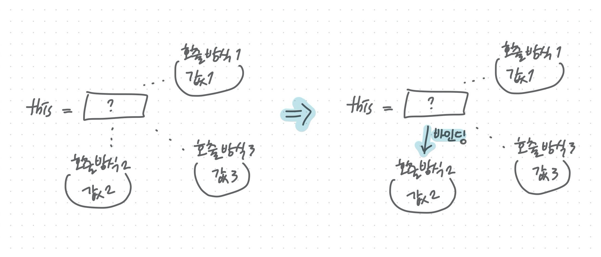

# JavaScript lesson 22

## this

### 1. this 키워드

메소드는 자신이 속한 객체를 가리키는 식별자를 참조할 수 있어야 자신이 속한 객체의 프로퍼티를 참조 할 수 있다.

- 객체 리터럴 방식으로 생성한 객체의 경우

  메소드 내부에서 메소드 자신이 속한 객체를 가리키는 식별자를 재귀적으로 참조 가능

  ```js
  const circle = {
    // 프로퍼티: 객체 고유의 상태 데이터 = 변할 수 있음, 변하지 않는다고 해도 다른 메소드로 다른 값을 도출할 수 있다.
    // 지역변수가 아닌 프로퍼티!!!임
    radius: 5,
    // 메소드: 상태 데이터를 참조하고 조작하는 동작
    getDiameter() {
      // 호출 되기전에는 아무것도 아님..
      // 이 메소드가 자신이 속한 객체의 프로퍼티나 다른 메소드를 참조하려면
      // 자신이 속한 객체 circle 참조할 수 있어야 한다.
      return 2 * circle.radius;
    }
  };
  
  console.log(circle.getDiameter()); // 10
  ```

  할당 단계 - 객체 리터럴 평가

  getDiameter 메소드가 호출되는 시점 `circle.getDiameter()` - 객체 리터럴 평가 완료되어 객체가 생성되었고 식별자 circle에 생성된 객체가 할당된 이후임

  따라서 메소드 내부에서 식별자 circle을 참조할 수 있다.

  이 방식은 부작용이 심하다. 다양한 호출 방식이 있기 때문이다.

  

- 생성자 함수 방식으로 인스턴스를 생성하는 경우

  생성자 함수를 정의하는 시점에는 아직 인스턴스를 생성하기 이전이므로 **생성자 함수가 생성할 인스턴스를 가리키는 식별자를 알 수 없다.** 따라서 자신이 속한 객체 또는 자신이 생성할 인스턴스를 가리키는 특수한 식별자가 필요하다.

  이를 위해 자바스크립트는 **this**라는 특수한 식별자를 제공!!

  **[ this ]**

  객체의 프로퍼티에 접근하기 위해 this가 필요하다.

  this가 없다면 자신의 프로퍼티에 접근하기 곤란하다.

  ```js
  function Circle(radius) {
    // 이 시점에는 생성자 함수 자신이 생성할 인스턴스를 가리키는 식별자를 알 수 없다.
    ????.radius = radius;
  }
  
  Circle.prototype.getDiameter = function () {
    // 이 시점에는 생성자 함수 자신이 생성할 인스턴스를 가리키는 식별자를 알 수 없다.
    return 2 * ????.radius;
  };
  
  // 생성자 함수로 인스턴스를 생성하려면 먼저 생성자 함수를 정의해야 한다.
  const circle = new Circle(5);
  ```

  **자신이 속한 객체** 또는 **자신이 생성할 인스턴스**를 **가리키는 자기 참조 변수** 이다.

  this를 통해 자신이 속한 객체 또는 자신이 생성할 인스턴스의 **프로퍼티나 메소드를 참조**할 수 있다.

  this가 가리키는 값, 즉 this 바인딩은 **함수 호출 방식에 의해 동적으로 결정**된다.

  - 클래스 기반 언어는 클래스 안에서만 사용 할 수 있다. this는 클래스가 생성한 인스턴스를 가리킨다. 

  

  **[ 바인딩 ]**

  식별자와 값을 연결하는 과정

  

  this는 어디서든 사용할 수 있다. 

  일반 함수로 호출된다는 과정에서 this를 사용할 수 있는데 이때의 목적은 없다. 하지만 this는 일반함수에서 유효하다. 왜냐면 걔가 생성자 함수로도 호출이 가능하기 때문이다. 즉, 함수는 어떻게 호출(생성자 함수, 일반 함수, 메소드)될지 모르니까 this가 사용이 가능한 것이다.

  

### 2. 함수 호출 방식과 this 바인딩

렉시컬 스코프와 this 바인딩 결정 시기가 다르다.

| 함수가 상위 스코프 결정하는 방식 (렉시컬 스코프) | this에 바인딩 될 객체 결정 방식 |
| ------------------------------------------------ | ------------------------------- |
| 함수 객체가 생성되는 시점의 위치                 | 함수 호출 시점                  |

#### 2.1 일반 함수 호출

**기본적으로 this에는 전역 객체(window)가 바인딩 된다.**

```js
function foo() {
  console.log("foo's this: ", this);  // window
  function bar() {
    console.log("bar's this: ", this); // window
  }
  bar();
}
foo();
```

일반 함수로 호출하면 함수 내부의 this에는 전역 객체가 바인딩된다. 그러나  this는 객체의 프로퍼티나 메소드를 참조하기 위한 자기 참조 변수이므로 객체를 생성하지 않는 **일반 함수에서 this는 의미가 없다.**

**🙄 궁금사항**

---

**Q.** 왜 일반함수에서 this를 호출하면 전역 객체에 바인딩 되는거지????

**A.** 메소드 또는 생성자 함수로 호출 가능성이 있어 this를 사용할 수 있다.

---

일반 함수로 호출되면 중첩 함수 내부의 this에는 전역 객체가 바인딩된다.

```js
var value = 1;
// const 키워드로 선언한 변수 value는 전역 객체의 프로퍼티가 아니다.
// const value = 1;

const obj = {
  value: 100,
  foo() {
    console.log("foo's this: ", this);  // {value: 100, foo: ƒ}
    console.log("foo's this.value: ", this.value); // 100

    // 메소드 내에서 정의한 중첩 함수
    function bar() {
      console.log("bar's this: ", this); // window
      console.log("bar's this.value: ", this.value); // 1 -> 잠깐 객체화 됨 그렇기때문에 window.value 임
    }

    // 메소드 내에서 정의한 중첩 함수도 일반 함수로 호출되면
    // 중첩 함수 내부의 this에는 전역 객체가 바인딩된다.
    bar();
  }
};

obj.foo();
```

외부 함수인 메소드와 중첩 함수의 this가 일치하지 않는다는 것은 중첩 함수 또는 콜백 함수(보조 함수)를 헬퍼 함수로 동작하기 어렵게 만든다.

메소드 내부의 콜백 함수

```js
var value = 1;

const obj = {
  value: 100,
  foo() {
    console.log("foo's this: ", this); // {value: 100, foo: ƒ}
    // 콜백 함수 내부의 this에는 전역 객체가 바인딩된다.
    setTimeout(function () {
      console.log("callback's this: ", this); // window
      console.log("callback's this.value: ", this.value); // 1
    }, 100);
  }
};

obj.foo();
```

메소드 내부의 중첩함수, 메소드 내부의 콜백함수는 문맥이 안맞는다. 

```js
var value = 1;

const obj = {
  value: 100,
  foo() {
    // 콜백 함수에 명시적으로 this를 바인딩한다. <- 요 지점에서의 this를 주입한다.
    setTimeout(function () {
      console.log(this.value); // 주입 전 window였지만 this를 바인드 해줌으로써 this를 바인드한다. => 100
    }.bind(this), 100);
    // bind(this)는 함수 외부이다.
  }
};

obj.foo();????
```


#### 2.2 메소드 호출

메소드 내부의 this는 **메소드를 호출한 객체**, 즉 메소드 이름 앞의 마침표(.) 연산자 앞에 기술한 객체에 바인딩된다.

```js
const person = {
  name: 'Lee',
  getName() {
    // 메소드의 this는 메소드를 호출한 객체에 바인딩된다.
    return this.name;
  }
};

// 메소드 getName을 호출한 객체는 person이다.
console.log(person.getName());
```

person 객체와 getName 프로퍼티가 가리키는 함수 객체는 별도의 객체이다. getName 프로퍼티가 생성된 함수 객체를 가리키고 있을 뿐이다????

Person이라는 객체와 function object의 객체는 다른 객체이지만 getName이 function object을 가리키는 것 뿐이다.

```js
const anotherPerson = {
  name: 'Kim'
};
// 메소드 getName을 anotherPerson 객체의 메소드로 할당
anotherPerson.getName = person.getName;

// 메소드 getName을 호출한 객체는 anotherPerson이다.
console.log(anotherPerson.getName()); // kim

// 메소드 getName을 변수에 할당
const getName = person.getName;

// ????
// 메소드 getName을 일반 함수로 호출
console.log(getName()); // ''
// => getName 함수 내부에서 참조한 this.name은 window.name과 같다
// window.name은 브라우저 창의 이름을 나타내는 빌트인 프로퍼티이다. window.name의 값은 ‘’이다.
// 만약 Node.js 환경에서 실행하면 undefined가 출력된다.
```

메소드 내부의 this 어떤 객체가 호출하냐에 따라 다르다.


```js
//	Array.prototype.slice()
console.log([1,2,3].slice());

// 가변인자 함수
function sum () {
  console.log(arguments);
}
sum(1, 2, 3);
```

배열 함수의 고차 함수를 사용하고 싶다면?

```js
function sum() {
  Array.prototype.slice.call(arguments);
  // call을 사용함으로서 arguemnts.slice() 와 같은 효과가 남
}

sum(1, 2, 3)
//메소드를 사용할껀데 this를 arguments로 해라
```

결론 : 프로토타입 내에서 this가 사용되어진다.


#### 2.3 생성자 함수 호출

**생성자 함수 내부의 this에는 생성자 함수가 (미래에) 생성할 인스턴스가 바인딩된다.**

```js
// 생성자 함수
function Circle(radius) {
  // 생성자 함수 내부의 this는 생성자 함수가 생성할 인스턴스를 가리킨다.
  this.radius = radius;
  this.getDiameter = function () {
    return 2 * this.radius;
  };
}

// 인스턴스의 생성
// 반지름이 5인 Circle 객체를 생성
const circle1 = new Circle(5);
// 반지름이 10인 Circle 객체를 생성
const circle2 = new Circle(10);

console.log(circle1.getDiameter()); // 10
console.log(circle2.getDiameter()); // 20
```

```js
// new 연산자와 함께 호출하지 않으면 생성자 함수로 동작하지 않는다.
// 즉, 일반적인 함수의 호출이다.
const circle3 = Circle(15);

// 일반 함수 Circle은 반환문이 없으므로 암묵적으로 undefined를 반환한다.
console.log(circle3); // undefined

// 일반 함수 Circle내의 this는 전역 객체를 가리킨다.
console.log(radius); // 15 ????
```

**🙄 궁금사항**

---

**Q.** 일반 함수로 호출했을때와 생성자 함수로 호출했을때 차이????

**A.** 값이 다르지...

---


#### 2.4 Function.prototype.apply/call/bind 메소드에 의한 간접 호출 

- apply와 call 메소드 

  Function.prototype의 메소드

  `함수객체.call `

  **역할** : 함수를 호출하는데 this를 바꾼다.

  apply와 call 메소드는 함수를 호출하면서 첫번째 인수로 전달한 특정 객체를 호출한 함수의 this에 바인딩

  대표적인 용도는 arguments 객체와 같은 유사 배열 객체에 배열 메소드를 사용하는 경우

  ```js
  function sum(a, b){
  //  console.log(this); // this
      console.log(this); // { x: 1 }
  	  return a + b + this.x // NaN
  }
  
  //	sum.call({ x: 1 });
  // 앞에 있는 함수를 호출 후 this를 교체한다.
  sum.apply({ x: 1 }, [10, 20]);	// 배열들로 인수를 준다
  sum.call({ x: 1 }, 10, 20);	// 인수들을 풀어서 준다.
  
  // this를 교체한다. 호출하려면 별도로 호출을 해야한다.
  sum.bind({ x: 1 })(10, 20);
  ```

  

  

- Function.prototype.bind 메소드

  apply와 call 메소드와는 달리 함수를 호출하지 않고 this로 사용할 객체만을 전달

  그렇기때문에 별도로 함수를 호출해야 한다.

  >  foo.bind(bar)(); this를 갈아끼운다. 강제적으로?...


| 함수 호출 방식                                             | this 바인딩                                                  |
| :--------------------------------------------------------- | :----------------------------------------------------------- |
| 일반 함수 호출                                             | 전역 객체                                                    |
| 메소드 호출                                                | 메소드를 호출한 객체                                         |
| 생성자 함수 호출                                           | 생성자 함수가 (미래에) 생성할 인스턴스                       |
| Function.prototype.apply/call/bind 메소드에 의한 간접 호출 | Function.prototype.apply/call/bind 메소드에 인자로 전달한 객체 |


```js
// 2진수 10진수

function myParseInt(binary) {
  const RADIX = 2;
  let res = 0;
  for (let i = 0; i < binary.length; i++) {
    res += binary[i] * RADIX ** (binary.length - (i + 1));
  }
  return res;
}

console.log(myParseInt('1010'));
```


