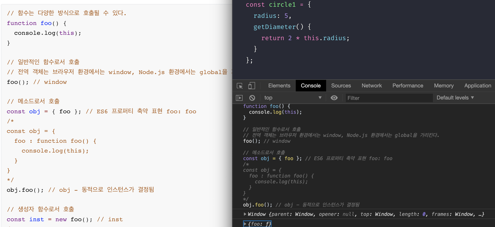

# JavaScript lesson 40

## 이벤트

### 1. 이벤트 드리븐 프로그래밍

이벤트 핸들러 : 이벤트가 발생했을 때 호출될 함수

이벤트 핸들러 등록 : 이벤트가 발생했을 때 브라우저에게 이벤트 핸들러의 호출을 위임하는 것

이벤트 핸들러를 호출해달라고 부탁한다.

DOM노드 객체에 등록한다. 왜 DOM노드 객체에 등록할까?

>  이벤트는 요소에서 발생된다. 그것을 브라우저가 감지한다. 감지하면 이 요소에 이벤트핸들러가 달려있는데 그것을 호출하는 것 이다. 

자바스크립트 엔진에서 호출이란 ? 실행컨텍스트 스택에 push하는 것

요소 노드의 프로퍼티 on___ 있는데 얘네를 이벤트 핸들러이다. 



```html
<!DOCTYPE html>
<html>
<body>
  <!-- input이 바뀔때마가 상태변경을 알고싶음 -->
  <input class="ck" type="checkbox">
  <button id="1" class="btn">0</button>
  <script>
    const $btn = document.querySelector('.btn');
    const $checkBox = document.querySelector('.ck');
    
    $checkBox.onchange = e => {
      console.dir(e.target);
    };
    
    let cnt = 0;
    $btn.onclick = function (e) {
      // 여기서 this가 호출했다는 보장이 없으면 $btn이다.
      // 하지만 this를 사용하지 않는게 좋다.
      console.log(this === $btn);
      // $btn.textContent;

      // (e)
      // 브라우저가 호출할때 인수를 전달하는데 이때, 이벤트객체를 전달한다.
      // 호출할때의 이벤트객체가 다르므로 이벤트객체 정보 또한 다르다.

      // (foo, e)
      // foo가 이벤트 객체, e는 의미가 없다.

      console.log(this === e.target); // true
      console.log(this);
      // 왜 true일까 ????
      // target은 이벤트 핸들러를 호출한 요소를 가리킨다.????
      console.log(e.target.textContent);

      console.log(typeof $btn.id); // String


      $btn.textContent = ++cnt;
    };
  </script>
</body>
</html>
```

[ 클로저 ]

```html
<!DOCTYPE html>
<html>
<body>
  <!-- input이 바뀔때마가 상태변경을 알고싶음 -->
  <input class="ck" type="checkbox">
  <button id="1" class="btn">0</button>
  <script>
    const $btn = document.querySelector('.btn');
    const $checkBox = document.querySelector('.ck');
    
    $checkBox.onchange = e => {
      console.dir(e.target);
    };

    $btn.onclick = (function () {
      let cnt = 0;
      return e => {$btn.textContent = ++cnt};
    }());
  </script>
</body>
</html>

```


### 


```html
<!DOCTYPE html>
<html>
<body>
  <button>0</button>
  <!-- <script>
    const $button = document.querySelector('button');

    let num = 0;
    // 이벤트 핸들러 프로퍼티에 이벤트 핸들러를 바인딩
    $button.onclick = function () {
      $button.textContent = ++num;
    };
  </script> -->

  <input type="text" placeholder="todo">
  <script>
    const $input = document.querySelector('input[type=text]');
    
    // 이벤트가 윈도우부터 타고 내려온다. 돔트리를 타고.. 실제로 이벤트를 실행시키는 타켓을 만나 다시 올라간다.
    // 캡쳐링페이지? or 버블링페이지?
    // 필터링이 필요햘 수 도 있다.
    $input.onkeyup = function (e) {
      // enter key가 입력되면
      // 브라우저가 이벤트 객체로 알려준다.
      // 브라우저가 호출됐을때 무조건 인수를 준다. 인수 = 이벤트객체

      // 13번 키가 안눌렸다면 그대로 리턴해서 무시해버리기
      if (e.keyCode !== 13) return;

      // keyCode가 13번
      console.log($input.value); 
      console.log(e.target.value);  
    }

  </script>
</body>
</html>
```

```html
<ul class = "todos">
    <li>html</li>
    <li>CSS</li>
    <li>JS</li>
</ul>
<script>
	const $ul = document.querySelector('.todos');
   $ul.onclick = function(e){ 
       //ul의 자식요소인 li 요소만 이벤트 발생해야함
       if (!e.target.matches('.todos > li')) return;
       console.log(e.target.textContent); 
   };
</script>
```


### 3. 이벤트 핸들러 등록

#### 3.1 이벤트 핸들러 어트리뷰트 방식

```html
<!DOCTYPE html>
<html>
<body>
  <button onclick="sayHi('Lee')">Click me!</button>
  <script>
    function sayHi(name) {
      console.log(`Hi! ${name}.`);
    }
  </script>
</body>
</html>
```

이벤트핸들러에 인수를 전달할수 있는 방법이 있어야하는데 이벤트 핸들러 프로퍼티에서 인수를 줄 수 없었는데 

- 이벤트 핸들러 프로퍼티 방식 - 이벤트함수에서 함수를 호출하면서 호출된 함수의 인수를 전달한다.

- 이벤트 핸들러 어트리뷰트 방식 - 함수의 문으로 들어갈 애들을 여러번 넣는다.

  `<button onclick="console.log('Hi! '); console.log('Lee');">Click me!</button>`

  => html에 js가 섞이는 것은 옳기 않다라는 사고 방식으로 사용하지 말자라는 의견이 나왔다. 하지만 리액트, 뷰등 나온 시점에서 어트리뷰트에서 사용하는 것을 따른다.

  ```html
  <!-- Angular -->
  <button (click)="handleClick($event)">Save</button>
  
  { /* React */ }
  <button onClick="{handleClick}">Save</button>
  
  <!-- Svelte -->
  <button on:click="{handleClick}">Save</button>
  
  <!-- Vue.js -->
  <button v-on:click="handleClick($event)">Save</button>
  ```

### 3.2. 이벤트 핸들러 프로퍼티 방식

이벤트 핸들러 어트리뷰트 방식은 내부적으로 프로퍼티 방식으로 작동한다.

### 3.3. addEventListener 메소드 방식


이벤트 타깃 : 이벤트를 발생시킬 객체

첫번째인수 : 문자열 타입

두번째인수 : 콜백함수 = 이벤트핸들러

세번째인수 : true 캡쳐링 이벤트, false 또는 비워두면 버블링 이벤트

```html
<!DOCTYPE html>
<html>
<body>
  <button>Click me!</button>
  <script>
    const $button = document.querySelector('button');

    // 이벤트 핸들러 프로퍼티 방식
    // $button.onclick = function () {
    //   console.log('button click');
    // };

    // addEventListener 메소드 방식
    $button.addEventListener('click', function () {
      console.log('button click');
    });
  </script>
</body>
</html>
```

**[ 이벤트 핸들러 프로퍼티 방식의 아쉬운 점 ]**

1. 캡처링을 제어할 수 없다
2. 이벤트 핸들러를 재할당하면 덮어 쓴다.

=> 그렇기때문에 이벤트 핸들러 addEventListener 메소드 방식이 나왔다.


### 4. 이벤트 핸들러 제거

**[ 이벤트 핸들러를 왜 제거해야 할까? ]**

이벤트 핸들러가 한번만 호출되길 원할때 사용한다.


```js
// 기명 함수를 이벤트 핸들러로 등록
$button.addEventListener('click', function foo() {
  console.log('button click');
  // 이벤트 핸들러가 호출되면 이벤트 핸들러를 제거한다.
  // 따라서 이벤트 핸들러는 단 한번만 호출된다.
  $button.removeEventListener('click', foo);
});
// 리무버이벤트리스너는 지울 이벤트를 참조할 수 있어야 함으로 두번째 인수에 참조할 이벤스 핸들러를 넣는다.
```


### 5. 이벤트 객체

#### 5.2 이벤트 객체의 공통 프로퍼티

| 프로퍼티         | 설명                                                         | 타입          |
| :--------------- | :----------------------------------------------------------- | :------------ |
| type             | 이벤트 타입                                                  | 문자열        |
| target           | 이벤트를 발생시킨 DOM 요소                                   | DOM 요소 노드 |
| currentTarget    | 이벤트 핸들러가 바인딩된 DOM 요소                            | DOM 요소 노드 |
| eventPhase       | 이벤트 전파 단계를 나타낸다. 0: 이벤트 없음, 1: 캡처링 단계, 2: 타깃 단계, 3: 버블링 단계 | 숫자          |
| bubbles          | 이벤트를 버블링으로 전파하는지 여부를 나타낸다. 아래 이벤트는 bubbles: false로 버블링하지 않는다. - 포커스 이벤트 focus/blur - 리소스 이벤트 load/unload/abort/error - 마우스 이벤트 mouseenter/mouseleave | 불리언        |
| cancelable       | preventDefault 메소드를 호출하여 이벤트의 기본 동작을 취소할 수 있는지 여부를 나타낸다. 아래 이벤트는 cancelable: false로 취소할 수 없다. - 포커스 이벤트 focus/blur - 리소스 이벤트 load/unload/abort/error - 마우스 이벤트 dbclick/mouseenter/mouseleave | 불리언        |
| defaultPrevented | preventDefault 메소드를 호출하여 이벤트를 취소하였는지 여부를 나타낸다. | 불리언        |
| isTrusted        | 사용자의 행위에 의해 발생한 이벤트인지 여부를 나타낸다. 자바스크립트 코드를 통해 인위적으로 발생시킨 이벤트, 예를 들어 click 메소드 또는 dispatchEvent 메소드를 통해 발생시킨 이벤트인 경우, isTrusted는 false이다.(“40.11. 커스텀 이벤트” 참고) | 불리언        |
| timeStamp        | 이벤트가 발생한 시각(1970/01/01/00:00:00부터 경과한 밀리초)  | 숫자          |

`currentTarget`는 `this`와 같다????


### 6. 이벤트 전파

실제로 이벤트를 발생시킨 요소는 무엇인가를 알아야함 => e.target을 사용해야한다.

```html
<!DOCTYPE html>
<html>
<body>
  <ul id="fruits">
    <li id="apple">Apple</li>
    <li id="banana">Banana</li>
    <li id="orange">Orange</li>
  </ul>
  <script>
    const $fruits = document.getElementById('fruits');

    $fruits.onclick = e => {
      // 이벤트 위임
      // 이벤트를 발생시킨 놈과 $fruits와 같다면 리턴
      if (e.target === $fruits) return;

      // 이벤트 위임 다른 방식
      // if (e.target.matches('#fruits')) return;

      // 이벤트 위임 다른 방식
      // if (e.target.nodeName === 'UL') return;


      // 이벤트를 발생시킨 놈을 잡아야함 그러므로 이벤트객체(e)가 필요함
      console.log(e.target.id);
    };
  </script>
</body>
</html>
```

```html
<!-- 위에와 비교 -->
<!DOCTYPE html>
<html>
<body>
  <ul id="fruits">
    <li id="apple">Apple</li>
    <li id="banana">Banana</li>
    <li id="orange">Orange</li>
  </ul>
  <script>
    const $ul = document.querySelector('ul');

    // 이벤트를 캡처링 단계에서 캐치한다.
    // $ul 요소보다 상위 요소에서 발생한 이벤트는 캐치할 수 없다.
    $ul.addEventListener('click', e => {
      console.log(`이벤트 타깃: ${e.target.id}`);
    }, true);
  </script>
</body>
</html>
```


>CBD - ????
>
>SPA - single page application
>
>html을 일부로 만들어서 어딘가의 안으로 appendchild를 한다.
>
>href를 사용하더라도 페이지를 갈아끼는것이 아닌 추가를 한다.


이벤트 핸들러 내의 this는 current target을 가리킨다.


####  9.2. 이벤트 핸들러 프로퍼티 방식과 addEventListener 메소드 방식

```html
<!DOCTYPE html>
<html>
<body>
  <button class="btn">0</button>
  <script>
    // DOM query를 가져와야한다 = 요소를 가져와야한다.
    class App {
      constructor() {
        this.$button = document.querySelector('.btn');
        this.count = 0;
        // this는 생성할 객체

        // increase 메소드를 이벤트 핸들러로 등록
        // 이벤트 핸들러 increase 내부의 this는 DOM 요소(this.$button)를 가리킨다.
        this.$button.onclick = this.increase;
        // this.$button는 요소노드 객체
        // increase 메서드를 this에 단다.
        // -> TypeError: Cannot set property 'textContent' of undefined
        
        // 그러므로 .bind를 이용하여 this를 통일시킨다.
        // this.$button.onclick = this.increase.bind(this);
      }

      increase() {
        this.$button.textContent = ++this.count;
      }
    }

    new App();
  </script>
</body>
</html>
```


```html
<!-- 
  1. Input에 글을 입력하고 엔터를 누르면 = 키보드 이벤트 : keydown
  2. li 요소에 textContent로 추가하는데 DOM에 ul.list가 있는지 확인
  2-1. 없다면 ul.list요소를 DOM에 추가
  2-2. 있다면 ul.list 자식인 li요소를 DOM에 추가
  3. placeholder ????
-->
<!DOCTYPE html>
<html>
<head>
  <style>
    .comleted{
      text-decoration: line-through;
    }
  </style>
</head>
<body>
  <input class="todoInput" type="text" placeholder="enter todo!">
  <ul id="todoList"></ul>

  <script>
    const $todoInput = document.querySelector('.todoInput');

    // 체크박스 요소
    const checkBox = '<input type="checkbox">';
    const $checkBox = document.querySelector('input[type=checkbox]');
    // 버튼 요소
    const removeBtn = '<button>X</button>';

    // keydown은 왜????
    $todoInput.onkeyup = function (e) {
      // 엔터키가 눌렸는지 아닌지 확인한다.
      if (e.keyCode !== 13) return;
      console.log('enter');
      // console.log(e);
      const addTodo = $todoInput.value;
      console.log(addTodo);

      document.getElementById('todoList').innerHTML += `<li>${checkBox} ${addTodo} ${removeBtn}</li>`;

      // input 어트리뷰트 리셋
      $todoInput.value = '';

    };

    $checkBox.onchange = function (e) {
      // if ($checkBox.value === 'checked') 
      $checkBox.className = e.target.checked ? '.comleted' : '';
    }; // => 체크박스가 생성되기 전에 이벤트 핸들러가 있기때문에 null이 나온다.
    
  </script>
</body>
</html>
```


```html
<!-- 정답 -->

<!DOCTYPE html>
<html>
<head>
  <style>
    /* input[type="checkbox"]:checked + span{
      text-decoration: line-through;
    } */
    .completed {
      text-decoration: line-through;
    }
  </style>
</head>
<body>
  <input class="input-todo" type="text" placeholder="enter todo!">
  <ul class="todos"></ul>

  <script>
   const $inputTodo = document.querySelector('.input-todo');
   const $todos = document.querySelector('.todos');
   
   $inputTodo.onkeyup = e => {
     // 엔터키가 눌렸는지 확인
     // 엔터가 눌렸는지의 정보는 이벤트 객체가 알고있다.
     if (e.keyCode !== 13 || $inputTodo.value.trim() === '') return;

     $todos.innerHTML += `<li>
        <input type="checkbox">
        <span>${$inputTodo.value}</span>
        <button>X</button>
      </li>`;
     // innerHTML 약점 : 무조건 뒤 html에 추가
     $inputTodo.value = '';
   };

   $todos.onclick = ({ target }) => {
     // { target }
     // 이벤트 객체의 타켓만 볼 수 있다. 디스트럭처링 할당으로
   
     // 실제 이벤트를 발생시킨 요소를 가져와야함
     //  console.log(e.target);

     // 이벤트를 발생시킨 애 = 버튼을 잡아야함
     if (!target.matches('.todos > li > button')) return;
   
     // button의 할아버지(ul)
     //  console.log(e.target.parentNode.parentNode);
     target.parentNode.parentNode.removeChild(target.parentNode);
   };

   $todos.onchange = ({ target }) => {
     // li요소 안에 값이 변경시킬 요소는 check 뿐이다. 따라서 필터해줄 필요가 없다.

     // .toggle은 completed가 있으면 class 삭제, 없으면 추가
     target.nextElementSibling.classList.toggle('completed');
   };
  </script>
</body>
</html>
```


