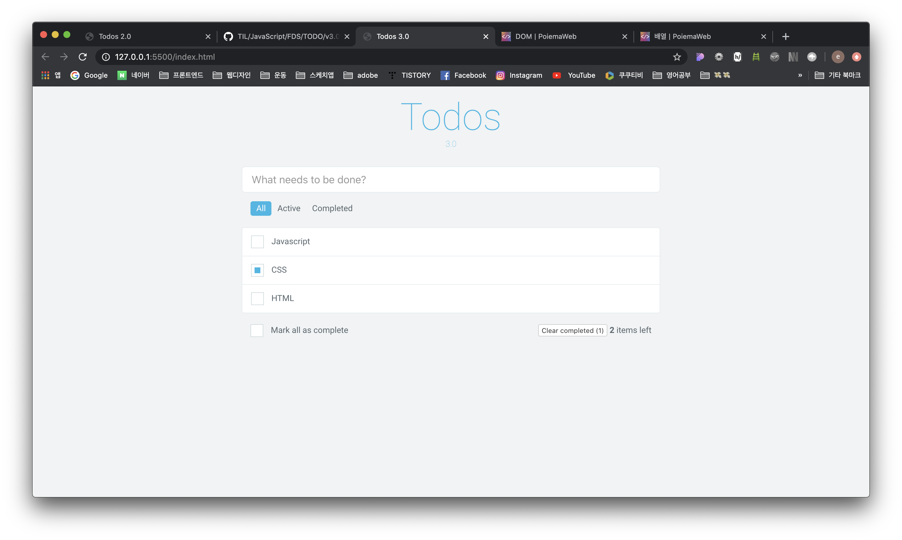

#  JavaScript lesson

## TODO v3.0



[ 도전1 ]

```js
// State
let todos = [];

// 1. 서버에서 리소스를 취득
// 2. 취득한 리소스를 화면에 출력

// DOMs
const $todos = document.querySelector('.todos');
const $nav = document.querySelector('.nav');
const $inputTodo = document.querySelector('.input-todo');
const $completeAll = document.getElementById('ck-complete-all');
const $completedTodos = document.querySelector('.completed-todos');
const $activeTodos = document.querySelector('.active-todos');
const $clearBtn = document.querySelector('.clear-completed .btn');


// FUNCTIONs
const render = () => {
  let html = '';
  let viewTodos = todos;
  const $active = document.querySelector('.active');
  // console.log($active.id);
  viewTodos = viewTodos.filter(todo => ($active.id === 'all' ? todo : ($active.id === 'active' ? !todo.completed : todo.completed)));

  viewTodos.forEach(({ id, content, completed }) => {
    html += `<li id="${id}" class="todo-item">
    <input id="ck-${id}" class="checkbox" type="checkbox" ${completed ? 'checked' : ''}>
    <label for="ck-${id}">${content}</label>
    <i class="remove-todo far fa-times-circle"></i>
  </li>`;
  });

  $todos.innerHTML = html;
  $completedTodos.textContent = completedTodos();
  $activeTodos.textContent = todos.length - completedTodos();

};

const generateId = () => Math.max(...todos.map(todo => todo.id), 0) + 1;

const addTodo = content => {
  todos = [{ id: generateId(), content, completed: false }, ...todos];
};

const removeTodo = id => {
  todos = todos.filter(todo => todo.id !== +id);
};

const completedAll = completed => {
  todos = todos.map(todo => ({ ...todo, completed }));
};

const completed = id => {
  todos = todos.map(todo => (todo.id === +id ? ({ ...todo, completed: !todo.completed }) : todo));
};

const completedTodos = () => todos.filter(todo => todo.completed).length;

const clearCompleted = () => {
  todos = todos.filter(todo => !todo.completed);
}

const getTodos = () => {
  todos = [
    { id: 1, content: 'HTML', completed: false },
    { id: 2, content: 'CSS', completed: true },
    { id: 3, content: 'Javascript', completed: false }
  ];

  todos.sort((todo1, todo2) => todo2.id - todo1.id);

  render();
};

window.onload = () => {
  getTodos();
};

// EVENTs
// NAV TODO
$nav.onclick = ({ target }) => {
  if (!target.matches('.nav > li')) return;
  document.querySelector('.active').classList.remove('active');
  target.classList.add('active');
  
  render();
};

// ADD TODO
$inputTodo.onkeyup = e => {
  if (e.keyCode !== 13) return;
  addTodo($inputTodo.value);
  $inputTodo.value = '';
  render();
};

// REMOVE TODO
$todos.onclick = ({ target }) => {
  if (!target.matches('.remove-todo')) return;
  removeTodo(target.parentNode.id);
  render();
};

// COMPLITED TODO
$todos.onchange = ({ target }) => {
  completed(target.parentNode.id);
  render();
};

// SELECT ALL
$completeAll.onchange = () => {
  completedAll($completeAll.checked);

  render();
};

// CLEAR COMPLETED
$clearBtn.onclick = ({ target }) => {
  clearCompleted();
  render();
};
```

- viewTodos 를 조건에 따라 filter 먹임
  조건 : 현재 active클래스가 붙어있는 id에 따라 보여줄 목록을 분류함

  => `target.id`로만 접근하려고 해서 어려웠음


[ 도전2 ]

```js
// State
let todos = [];

// 1. 서버에서 리소스를 취득
// 2. 취득한 리소스를 화면에 출력

// DOMs
const $todos = document.querySelector('.todos');
const $nav = document.querySelector('.nav');
const $inputTodo = document.querySelector('.input-todo');
const $completeAll = document.getElementById('ck-complete-all');
const $completedTodos = document.querySelector('.completed-todos');
const $activeTodos = document.querySelector('.active-todos');
const $clearBtn = document.querySelector('.clear-completed .btn');


// FUNCTIONs
const render = () => {
  let html = '';
  const $active = document.querySelector('.active');
  // console.log($active.id);
  let _todos = todos.filter(todo => ($active.id === 'all' ? todo : ($active.id === 'active' ? !todo.completed : todo.completed)));

  _todos.forEach(({ id, content, completed }) => {
    html += `<li id="${id}" class="todo-item">
    <input id="ck-${id}" class="checkbox" type="checkbox" ${completed ? 'checked' : ''}>
    <label for="ck-${id}">${content}</label>
    <i class="remove-todo far fa-times-circle"></i>
  </li>`;
  });

  $todos.innerHTML = html;
  $completedTodos.textContent = completedTodos();
  $activeTodos.textContent = todos.length - completedTodos();
  checkedCompletedAll();

  // viewTodos를 로컬스토리지에 저장
  localStorage.setItem('todos', JSON.stringify(_todos));
};

const generateId = () => Math.max(...todos.map(todo => todo.id), 0) + 1;

const addTodo = content => {
  todos = [{ id: generateId(), content, completed: false }, ...todos];
};

const removeTodo = id => {
  todos = todos.filter(todo => todo.id !== +id);
};

const completedAll = completed => {
  todos = todos.map(todo => ({ ...todo, completed }));
};

const checkedCompletedAll = () => {
  if (todos.every(todo => todo.completed) ? $completeAll.checked = true : $completeAll.checked = false);
}

const completed = id => {
  todos = todos.map(todo => (todo.id === +id ? ({ ...todo, completed: !todo.completed }) : todo));
};

const completedTodos = () => todos.filter(todo => todo.completed).length;

const clearCompleted = () => {
  todos = todos.filter(todo => !todo.completed);
}

const getTodos = () => {
  todos = [
    { id: 1, content: 'HTML', completed: false },
    { id: 2, content: 'CSS', completed: true },
    { id: 3, contentnav: 'Javascript', completed: false }
  ];
  
  // 저장된 로컬스토리지에서 todos 불러오기
  todos = JSON.parse(localStorage.getItem('todos'));

  todos = todos.sort((todo1, todo2) => todo2.id - todo1.id);
  render();
};

window.onload = () => {
  getTodos();
};

// EVENTs
// NAV TODO
$nav.onclick = ({target}) => {
  if (!target.matches('li')) return;
  document.querySelector('.active').classList.remove('active');
  target.classList.add('active');

  render();
};


// ADD TODO
$inputTodo.onkeyup = e => {
  if (e.keyCode !== 13 || $inputTodo.value.trim() === '') return;
  addTodo($inputTodo.value);
  $inputTodo.value = '';
  render();
};

// REMOVE TODO
$todos.onclick = ({ target }) => {
  if (!target.matches('.remove-todo')) return;
  removeTodo(target.parentNode.id);
  render();
};

// COMPLITED TODO
$todos.onchange = ({ target }) => {
  completed(target.parentNode.id);

  render();
};

// SELECT ALL
$completeAll.onchange = () => {
  completedAll($completeAll.checked);
  
  render();
};

// CLEAR COMPLETED
$clearBtn.onclick = () => {
  clearCompleted();
  render();
};
```


- 로컬스토리지 저장할 수 있도록 추가
- Mark all as complete가 체크되어 있는 상태에서 todo 리스트 중 하나라도 체크가 해제되면 Mark all as complete도 해제되는 기능 추가


---

- 