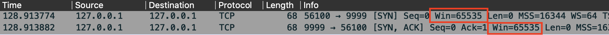
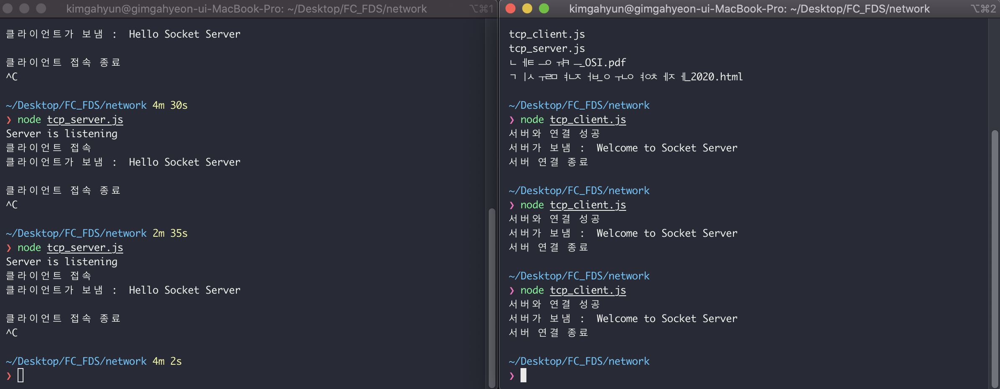
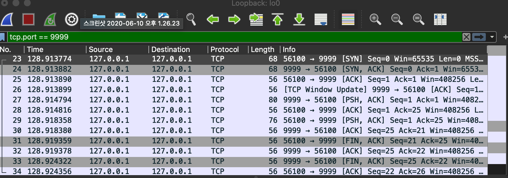

# Network lesson

## 커버 범위에 따른 네트워크 구분

- LAN: 건물등 특정 지역을 범위로 하는 네트워트(강의실)
- WAN: 인터넷 서비스 제공자등이 제공하는 광역 네트워트 (집에서 사용하는 와이파이)
- WLAN: 무선 근거리 네트워크

## 프로토콜

각각의 역할을 하는 프로토콜이 있고 그 프로토콜을 모아서 전송한다.

http request의 헤더와 바디가 있고 헤더는 프로토콜정보가 있다 ????

단계마다 해당 프로토콜의 헤더를 데이터 정보에 붙여 물리적으로 전송된다. 받는 입장에서는 해당 프로토콜의 정보를 실행하고 요청한 데이터를 확인한다. 

### OSI 7 Layer

피지컬레이어 - 전기신호

중간에 있는 프로토콜을 필요에 따라 바꿔치기가 가능하다.

| 계층 | 이름            | 설명                                                         |
| ---- | --------------- | ------------------------------------------------------------ |
| 7    | 응용 계층       | http프로토콜                                                 |
| 6    | 표현 계층       | 네트워크 이용시 다 모니터링이 가능한데 이를 방지하기 위해 암호화 하는 것 |
| 5    | 세션 계층       |                                                              |
| 4    | 전송 계층       | 데이터가 왔다갔다할때 유실될 수도 있는데 그때 유실된 데이터를 어떻게 처리할 것인지 등을 처리하는것 |
| 3    | 네트워크 계층   | 많은 네트워크 중 식별할 수 있는 주소 결정 (IP 주소)          |
| 2    | 데이터링크 계층 | 네트워크 기기간 데이터 전송 및 물리 주소 결정                |
| 1    | 물리 계층       | 전기신호                                                     |


### 캡슐화와 역캡슐화

보내려는 데이터보다 헤더의 크기가 더 크면 비효율적일 수도 있지만 모든 데이터는 헤더와 바디영역으로 나누어 보낸다.

- 송신측: 캡슐화
- 수신측: 역캡슐화
- 헤더: 데이터 송신시, 필요한 정보를 데이터에 추가
- 바디: 실제 데이터


### 물리 계층 (Physical Layer)

- 전기신호를 다루는 계층

  0 또는 1로 바꿔주는 장치를 다루는 소프트웨어


### 데이터링크 계층 

- 물리적 네트워크 사이의 데이터 송수신 담당
- 대표적으로 LAN선을 사용

- 대표적인 프로토콜: 이더넷 프로토콜
- 고유한 MAC Address로 구분한다.
- 기기끼리 통신하는 역할


### 네트워크 계층

- 각각의 컴터 주소를 알아야 통신이 되는데 이것이 IP주소이다.

- 대표적인 프로토콜: IP 프로토콜

- 여러가지 네트워크를 핸들링할때 IP 주소로 핸들링한다.

  | IP header                                            | data |
  | ---------------------------------------------------- | ---- |
  | Version / Source IP Address / Destination IP Address |      |

- 네트워크를 넘나들면서 통신하는 역할


### 전송 계층

- 주소를 통해서 해저 광케이블 타고 갈때 중간에 유실될 수 있는 데이터를 확인하는 역할

- 대표적인 프로토콜: TCP, UDP 프로토콜

- | IP header                                | data |
  | ---------------------------------------- | ---- |
  | Source Port / Destination Port/ Checksum |      |

웹서버를 구축할때도 포트를 지정해야한다.

Cheksum - 지금 보이는 비트가 문제가 있는지 없는지 확인하는 간단한 계산식

Port - 목적지의 어떤 응용프로그램에 데이터를 전달해야 하는지를 식별하는 기능

포트 세팅은 전송 계층에서 세팅한다.


#### TCP VS UDP 프로토콜

- TCP

  데이터를 철저하게 관리하나 속도가 느림

  연결할때부터 어떻게 연결하겠다고 약속함.

  대표) 채팅서비스

  

- UDP

  유실되어도 그냥 전송보내는 프로토콜

  연결이 없고 유실이 되어도 괜찮기 때문에 전송속도가 빠름

  대표) 스트리밍-영화


#### 포트(port) 번호

이 운영프로그램은 이 포트를 사용하라는 디폴트 값을 지정해둠

웹서버 - 포트 80 / 이메일 - 포트 110 / FTP - 포트 21번


### 세션 계층

### 표현 계층

### 응용 계층


#### TCP/IP 모델

OSI는 표준 레이어고 현실을 반영한 레이어는 TCP/IP모델이다

- 네트워느 접속 계층 = 물리 계층 / 데이터링크 계층
- 인터넷 계층 = 인테넷 계층
- 전송 계층  = 전송 계층
- 응용 계층 - 서션 계층 / 표현 계층 / 응용 계층

=> 보안에 취약함. 따라서 남들이 정보를 다 확인할 수 있다. 


## TCP, UDP 프로토콜

### IP

- IP주소는 32비트로 구성 : 0.0.0.0 ~ 255.255.255.255

- 자기 PC의 IP 주소: 127.0.0.1 (localhost)

- ping으로 해당 도메인주소를 입력하면 IP주소를 습득할 수 있다.

  ```code
  ping www.daum.net
  ```

> **IPv4에서 Pv6로 넘어가지 못하는 이유**
>
> 주소가 너무 길어져서 헤더 또한 길어짐으로 전송속도가 느려진다. 그러므로 IPv6로 넘어가지 못한다.


### TCP 연결 방식

- 3-way 핸드쉐이크

- 클라이언트 => 서버 : SYN (M)

  클라이언트 <= 서버 : SYN(N), ACK(M+1)

  클라이언트 => 서버 : SYN(N+1)

- ACK : 응답

세부적인 조건들이 있고 그것에 대해 동작하게 해놓았다. 


### TCP 전송

전송부분은 시퀀스넘버와 에크넘버로 교환한다.

- Sequence Number

- ACK Number

  ACK가 안오면 기다렸다가 만들었던 패킷을 다시보낸다.


### TCP 연결 해제

- 4-way 핸드쉐이크


### TCP 제어

#### 흐름제어

- Sliding Window

  1-3번 데이터까지 보내고 ACK가 온다.

  사이즈를 어떻게 하느냐에 따라 초기에 빠르고 많은 것을 서버에 보낼 수 있다.

  > **그럼 사이즈를 어떻게 정할까?**
  >
  > 원래는 클라이언트가 서버에 보낼때 한번에 전송할 수 있는 역량을 알수 있다. 성능이 높으면 많이, 낮으면 적게 보낸다. 서버 컴퓨터도 상황에 맞춰 전송 받을 수 있는 사이즈를 정해서 다시 클라이언트에 보내고 클라이언트는 서버의 사이즈에 맞춰서 다시 서버한테 보낸다.

  ACK를 받을때까지 너무 느리니 기다리지 않고 보낸다. TCP가 더 빨라진다. 

- Stop and Wait

  1번 데이터를 보내면 1번 데이터가 왔다는 ACK를 보냄

  => 속도가 느림

#### 혼합제어

- Receive Window : 슬라이딩 윈도우 사이즈
- Congestion Window : 
- 한 인터넷 망에 여러사람이 접속하게 되면 느려질 수 있는데 그걸 어떻게 파악할것인지에 대한 것
- AIMD => Slow Start 및 혼잡 회피


UDP는 TCP보다 상대적으로 빠르다.


## 와이어샤크

네트워크 패킷을 캡쳐하고 분석하는 오픈소스 도구

1. 서버를 먼저 실행한다.

2. 와이어 샤크로 패킷을 캡쳐한다.
   여러가지 조건을 달 수 있다.

   예) `tcp.port == 9999`


>  **왜 테스트를 해야할까? 화면만보고 하면 되지않을까?**
>
> 사람이 이해하기 위해서는 자기 스스로 무언가를 보고 직접 확인하는게 더 좋은 방법이기때문!


## Application Protocol

protobuf - 직렬화 데이터 구조

### HTTP 1.1

- Keepalive???? 지원함으로서 3-way handshake 과정을 거칠 필요가 없어짐


### HTTPS

- 암호화해서 통신을 한다. 
- 표현계층
- 구글 상단에 노출된다.


> **HTTPS로 왜 보내야할까?**
>
> 헤더까지 암호화해서 보낸다.
>
> HTTP는 해커들이 마음만 먹으면 정보를 해킹할 수 있다.


### 네트워크 보안

- 대칭키

- 비대칭키

  공개키, 개인키


### REST

자원의 표현에 의한 상태 전달

CRUD


### 메일 서버

- SMTP: 메일 송신

  송신할때 MIME 프로토콜을 사용한다.

- POP3: 메일 수신

  - POP3: 중앙 서버에서 로컬 장치로 이메일을 내려 받음
  - IMAP: 중앙 서버에서 메일 동기화


### FTP

- 2개 포트 사용 = 두가지의 기능이 필요하다.

  21번, 20번

