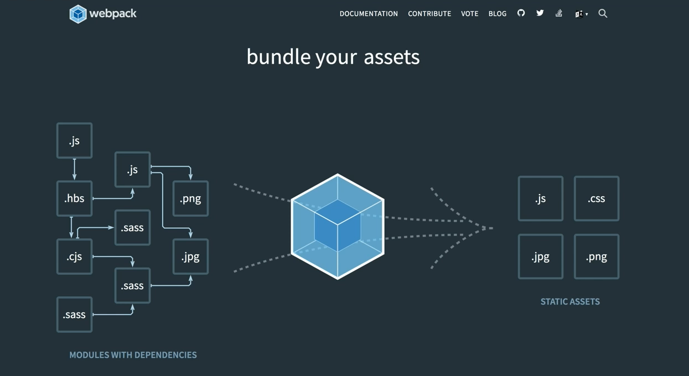
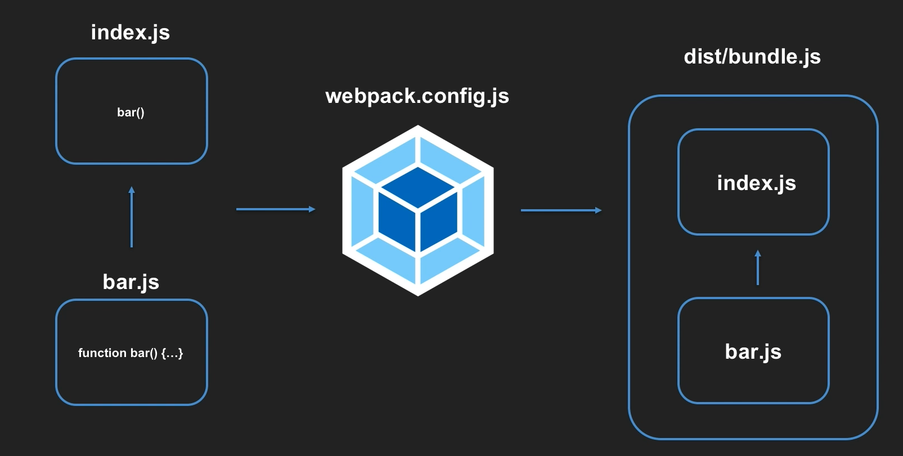

# Webpack 기본 구조


모듈들의 의존성을 안전하게 지키면서 하나의 파일로 만드는 것


## Entry
모듈의 의존 관계를 이해하기 위한 시작점을 설명
`src/`

## Output
Webpack이 생성하는 번들 파일에 대한 정보를 설명
`dist/`

`npm i webpack-cli` : 웹팩 명령어를 실행할 수 있도록 하는 기능

`npx` : node_modules/.bin 으로 직접 명령하지 않고 npx로 간단하게 명령할 수 있는 기능

`npx webpack --target=node`: target으로 웹팩이 어느 실행 환경인지 설정

## `webpack.config.js`
webpack에 대한 설정내용을 지정할 수 있음`
```js
// __dirname : node에서 제공하는 내장 모듈
// path module : 파일경로를 쉽게 조작

const path = require('path');

module.exports = {
  entry: './src/index.js',
  output: {
    path: path.resolve(__dirname, 'dist');
    filename: 'bundle.js'
  },
  target: 'node'
}
```
bundle이 되면 `dist/bundle.js`로 나올 것이다.

## Mode
### Package.json
1. 어플리케이션 내부에 직접 포함되는 모듈
- dependencies : `--save`
예) 제이쿼리 
2. 개발 과정에 필요한 모듈
- devDependencies : `--save-dev`
예) 개발하는 환경에 영향을 주는 것들

## Loader
다양한 모듈들을 입력받아 처리하는 역할
```js
module.exports = {
  module: {
    rules: [loader1, loader2]
  }
}
```

## Plugin
웹팩이 동작하는 과정에 전체적으로 개입할 수 있어 여러가지 역할을 함
번들파일에 변화를 주기도 하고 개발모드에서 개발 편의성을 제공하거나 프러덕션 모드에서 코드의 최적화를 진행
